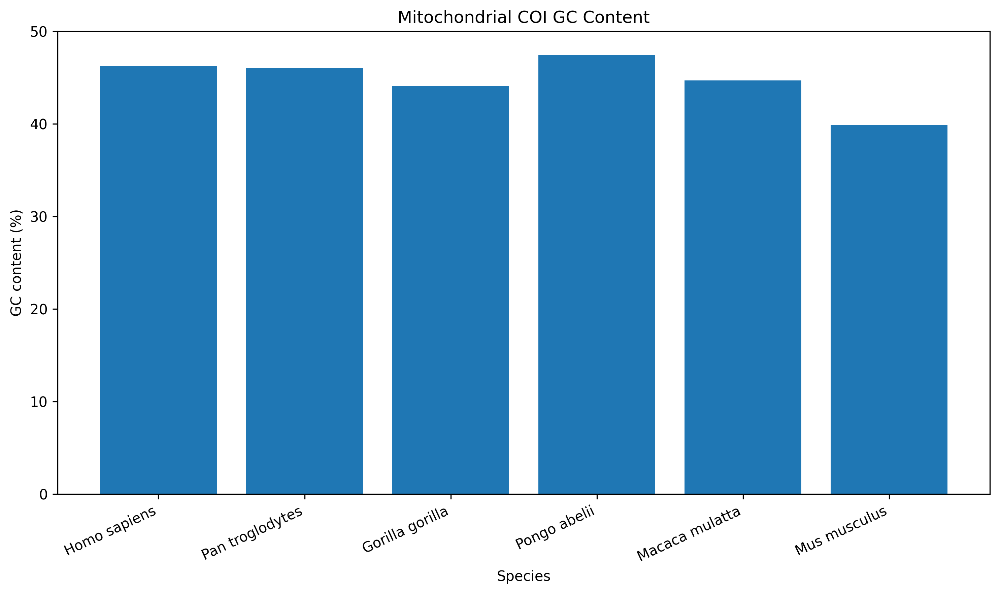
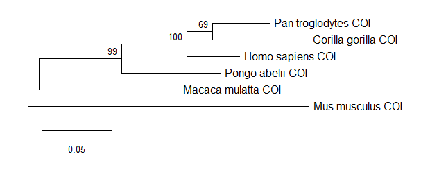
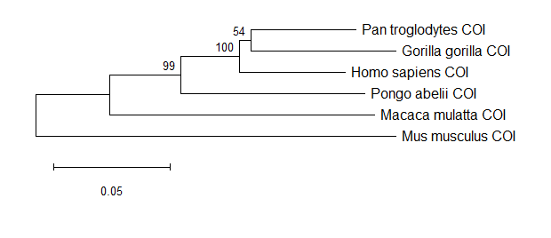

# Comparative Analysis of Mitochondrial COI Sequences to Investigate Evolutionary Relationships Among Selected Mammals

## Research Question

Can mitochondrial COI DNA sequence variation be used to reconstruct evolutionary relationships among selected mammalian species?

## Project Overview

This project investigates evolutionary relationships among six selected mammalian species using mitochondrial cytochrome c oxidase subunit I (COI) DNA sequences.

Real mitochondrial DNA sequences were retrieved from the NCBI GenBank database and analyzed using Python, Biopython, and MEGA. Sequence composition, GC content, evolutionary distances, and phylogenetic relationships were examined.

Two phylogenetic approaches were used: Maximum Likelihood and Neighbor-Joining, with bootstrap analysis to assess the support of inferred relationships.

## Dataset

The analysis included mitochondrial COI sequences from six mammalian species:

| Species | Scientific name |
|---|---|
| Human | *Homo sapiens* |
| Chimpanzee | *Pan troglodytes* |
| Gorilla | *Gorilla gorilla* |
| Sumatran orangutan | *Pongo abelii* |
| Rhesus macaque | *Macaca mulatta* |
| House mouse | *Mus musculus* |

The mitochondrial sequences were retrieved from the NCBI GenBank database. The COI region was identified from the annotated mitochondrial genomes and extracted for analysis using Python and Biopython.

## Tools and Workflow

### Tools

- **NCBI GenBank** — retrieval of mitochondrial DNA sequences and gene annotations
- **Python** — sequence processing and quantitative analysis
- **Biopython** — reading, extracting, and analyzing DNA sequences
- **MEGA 12** — multiple sequence alignment, evolutionary-distance analysis, and phylogenetic reconstruction
- **Microsoft Excel** — organization and presentation of evolutionary-distance results

### Workflow

1. Retrieved complete mitochondrial genome sequences from NCBI GenBank.
2. Identified the annotated COI/COX1 gene region for each species.
3. Extracted the COI sequences using Python and Biopython.
4. Verified sequence lengths and calculated nucleotide composition and GC content.
5. Combined the six COI sequences into a single dataset.
6. Performed multiple sequence alignment using ClustalW in MEGA 12.
7. Calculated pairwise evolutionary distances using the Maximum Composite Likelihood method.
8. Constructed phylogenetic trees using Maximum Likelihood and Neighbor-Joining.
9. Used 500 bootstrap replications to evaluate support for phylogenetic relationships.
10. Compared the results from the two phylogenetic approaches.

## Main Results

### Nucleotide Composition

The COI sequences showed differences in nucleotide composition among the six species. GC content ranged from **39.87% in *Mus musculus*** to **47.44% in *Pongo abelii***.

### Evolutionary Distances

The MEGA analysis showed the following pairwise evolutionary distances:

| Species pair | Evolutionary distance |
|---|---:|
| *Homo sapiens* – *Pan troglodytes* | 0.0922 |
| *Homo sapiens* – *Gorilla gorilla* | 0.1176 |
| *Pan troglodytes* – *Gorilla gorilla* | 0.1081 |
| *Homo sapiens* – *Pongo abelii* | 0.1454 |
| *Pan troglodytes* – *Pongo abelii* | 0.1593 |
| *Gorilla gorilla* – *Pongo abelii* | 0.1729 |
| *Homo sapiens* – *Macaca mulatta* | 0.2285 |
| *Pan troglodytes* – *Macaca mulatta* | 0.2254 |
| *Gorilla gorilla* – *Macaca mulatta* | 0.2310 |
| *Pongo abelii* – *Macaca mulatta* | 0.2124 |
| *Homo sapiens* – *Mus musculus* | 0.2859 |
| *Pan troglodytes* – *Mus musculus* | 0.2965 |
| *Gorilla gorilla* – *Mus musculus* | 0.2973 |
| *Pongo abelii* – *Mus musculus* | 0.3077 |
| *Macaca mulatta* – *Mus musculus* | 0.3007 |

### Phylogenetic Analysis

Both Maximum Likelihood and Neighbor-Joining analyses produced the same overall topology. *Pan troglodytes* and *Gorilla gorilla* formed a group, with *Homo sapiens* joining this group, followed by *Pongo abelii*. *Macaca mulatta* and *Mus musculus* were placed more distantly.

Bootstrap support for the main internal nodes was:

| Relationship | Maximum Likelihood | Neighbor-Joining |
|---|---:|---:|
| *Pan troglodytes* + *Gorilla gorilla* | 69% | 54% |
| *Homo sapiens* + chimpanzee–gorilla group | 100% | 100% |
| *Pongo abelii* + great ape group | 99% | 99% |

## Figures

### GC Content Comparison

The GC content of the six COI sequences was compared to examine differences in nucleotide composition.



### Pairwise Evolutionary Distances

The evolutionary distances calculated in MEGA 12 were visualized as a distance heatmap.


### Maximum Likelihood Phylogenetic Tree

A Maximum Likelihood tree was constructed using the aligned COI sequences with 500 bootstrap replications.



### Neighbor-Joining Phylogenetic Tree

A Neighbor-Joining tree was constructed using the same aligned COI dataset with 500 bootstrap replications.



## Key Findings

- COI sequence composition varied among the six mammalian species, with GC content ranging from 39.87% to 47.44%.
- The lowest MEGA evolutionary distance was observed between *Homo sapiens* and *Pan troglodytes* (0.0922).
- The largest evolutionary distance in the dataset was between *Pongo abelii* and *Mus musculus* (0.3077).
- Maximum Likelihood and Neighbor-Joining produced the same overall phylogenetic topology.
- The *Homo sapiens* + chimpanzee–gorilla relationship received 100% bootstrap support in both methods.
- The *Pongo abelii* + great ape group received 99% bootstrap support in both methods.
- The chimpanzee–gorilla grouping received 69% support in Maximum Likelihood and 54% in Neighbor-Joining.

## Limitations

This project focuses on a single mitochondrial gene, COI, and therefore represents variation at this particular locus rather than the complete evolutionary history of the species. The dataset also contains only six mammalian species. In addition, no nucleotide substitution model-selection analysis was performed. Future work could include a larger number of species, additional mitochondrial or nuclear genes, and larger genomic datasets to provide a broader view of evolutionary relationships.

## Repository Structure

```text
COI_Phylogenetic_Analysis/
├── data/
├── scripts/
├── results/
├── figures/
├── README.md
└── project_notes.docx

## Reproducibility

The analysis was performed using real mitochondrial DNA sequences retrieved from NCBI GenBank. Python and Biopython were used for sequence extraction and nucleotide-composition analysis, while MEGA 12 was used for sequence alignment, evolutionary-distance analysis, and phylogenetic reconstruction.

The Python scripts and processed sequence files are organized in the repository so that the analysis workflow can be reviewed and reproduced.